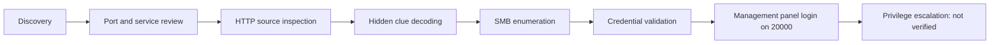

<p align="center"></p>

# Empire: Breakout — VulnHub Professional Write-up

[](#) [](#) [](#) [](#) [](#)

**Languages:** [Türkçe](README_TR.md) | [English](README_EN.md)

## Spoiler Warning

This repository documents the reasoning and evidence from an Empire: Breakout VulnHub lab attempt. It contains spoilers for discovery, enumeration and the verified initial-access path.

## Ethical Use

This material is for authorized training labs only. Do not use these notes against internet-facing or third-party systems. No live target scanning or credential testing was performed while preparing this repository.

## Project Summary

The available local evidence supports an enumeration-driven path: network discovery, HTTP inspection, hidden HTML clue review, SMB enumeration, credential validation and a successful login to the management panel on port `20000`. User/root proof and privilege escalation were not present in the local evidence and are documented as **not verified**.

## Lab Scope

| Field | Value |
| --- | --- |
| Machine | Empire: Breakout |
| Platform | VulnHub |
| Target IP | `10.158.174.179` |
| Evidence source | Local sanitized README drafts, notes and screenshot package |
| Out of scope | Real systems, internet targets, VM disk files, brute-force against non-lab systems |

## Tools Used

`nmap`, `netdiscover`, `curl`, `gobuster`, `smbclient`, `enum4linux`, and a web browser are verified from the local notes. Hydra use was searched for but not verified in the local evidence.

## Attack Chain Summary



## Repository Structure

```text
assets/      Real screenshots, SVG banner and diagrams
docs/tr/     Turkish technical documentation
docs/en/     English technical documentation
evidence/    Sanitized notes and selected supporting output
.github/     Issue templates and validation workflows
```

## Documentation

- [Türkçe dokümantasyon](docs/tr/00-lab-bilgileri.md)
- [English documentation](docs/en/00-lab-information.md)

## Skills Demonstrated

- Evidence-based enumeration writing
- HTTP and SMB service correlation
- Credential-context validation in a legal lab
- Defensive mapping for SOC and system administration review
- Bilingual technical documentation

## Defender Perspective

The write-up includes detection opportunities for web access logs, SMB logs, authentication logs, Webmin/MiniServ-style panel logs, firewall logs and process execution records where relevant.

## Reproduction Requirements

A local VulnHub lab network and the Empire: Breakout VM are required. VM images are intentionally not included in this repository.

## License

MIT License. See [LICENSE](LICENSE).

## Author

İsmail ŞAHİN