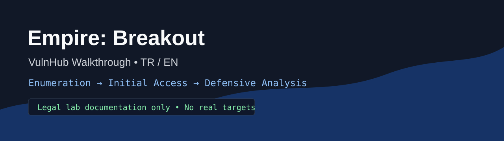

# Empire: Breakout — VulnHub Professional Write-up

[Türkçe](README_TR.md) | [Main README](README.md)

## Spoiler Warning

This repository explains the discovery, enumeration and verified initial-access workflow for the Empire: Breakout VulnHub lab. It contains solution spoilers.

## Ethical Use Notice

This documentation is only for authorized training labs. It must not be used for scanning, password testing or unauthorized access against real systems.

## Project Summary

The evidence-supported chain consists of target discovery, HTTP inspection, a hidden HTML clue, SMB enumeration, credential validation and login to the management panel on port `20000`. User/root proof and privilege escalation were not present in the local evidence and are explicitly marked as not verified.

## Lab Scope

| Field | Value |
| --- | --- |
| Machine | Empire: Breakout |
| Platform | VulnHub |
| Target IP | `10.158.174.179` |
| Evidence source | Local safe README drafts, notes and screenshot package |
| Out of scope | Real systems, internet targets, VM disk files, unauthorized brute force |

## Tools Used

Verified tools: `nmap`, `netdiscover`, `curl`, `gobuster`, `smbclient`, `enum4linux`, browser. Hydra use was not verified in the local evidence.

## Attack Chain Summary

## Technical Value

- Cross-service correlation
- Source-code inspection of default-looking web content
- SMB enumeration for username validation
- Treating failed attempts as useful signal
- Writing with defender log sources in mind

## Defender Perspective

The documentation evaluates web access/error logs, SMB logs, auth.log/secure, systemd journal, MiniServ/Webmin-style panel logs, firewall logs and process creation records where applicable.

## Reproduction Requirements

A local VulnHub lab network and the Empire: Breakout VM are required. VM files are not included in this repository.

## Documentation

- [00 - Lab information](docs/en/00-lab-information.md)
- [10 - Command reference](docs/en/10-command-reference.md)

## License

MIT License. See [LICENSE](LICENSE).

## Author

İsmail ŞAHİN