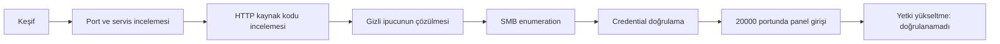

# Empire: Breakout — VulnHub Profesyonel Write-up

[English](README_EN.md) | [Ana README](README.md)

## Spoiler Uyarısı

Bu repo Empire: Breakout VulnHub laboratuvarına ait keşif, enumeration ve doğrulanmış ilk erişim sürecini açıklar. Çözüm akışına dair spoiler içerir.

## Etik Kullanım Bildirimi

Bu dokümantasyon yalnızca yetkili eğitim laboratuvarları içindir. Gerçek sistemlere karşı tarama, parola denemesi veya yetkisiz erişim amacıyla kullanılmamalıdır.

## Proje Özeti

Yerel dosyalardan doğrulanabilen zincir; hedef keşfi, HTTP incelemesi, HTML yorumundaki ipucu, SMB enumeration, credential doğrulama ve `20000` portundaki yönetim paneline giriş aşamalarından oluşur. User/root kanıtı ve privilege escalation adımları mevcut kanıtlarla doğrulanamadığı için açıkça bu şekilde işaretlenmiştir.

## Laboratuvar Kapsamı

| Alan | Değer |
| --- | --- |
| Makine | Empire: Breakout |
| Platform | VulnHub |
| Hedef IP | `10.158.174.179` |
| Kanıt kaynağı | Yerel güvenli README taslakları, notlar ve ekran görüntüsü paketi |
| Kapsam dışı | Gerçek sistemler, internet hedefleri, VM disk dosyaları, yetkisiz brute force |

## Kullanılan Araçlar

Doğrulanabilen araçlar: `nmap`, `netdiscover`, `curl`, `gobuster`, `smbclient`, `enum4linux`, tarayıcı. Hydra kullanımı yerel kanıtlarda doğrulanamadı.

## Saldırı Zinciri Özeti

## Öne Çıkan Teknik Kazanımlar

- Servisler arası veri ilişkilendirme
- Görünen web içeriği yerine kaynak kodu inceleme
- SMB enumeration ile kullanıcı doğrulama
- Başarısız denemeleri karar sürecine dahil etme
- Savunmacı log kaynaklarını düşünerek write-up yazma

## Savunmacı Bakış Açısı

Dokümantasyonda web access/error logları, SMB logları, auth.log/secure, systemd journal, MiniServ/Webmin tarzı panel logları, firewall logları ve süreç oluşturma kayıtları değerlendirilmiştir.

## Kurulum ve Yeniden Üretme Şartları

Bu çalışma için yerel VulnHub laboratuvar ağı ve Empire: Breakout VM gerekir. VM dosyaları bu repoya dahil edilmemiştir.

## Dokümantasyon

- [00 - Lab bilgileri](docs/tr/00-lab-bilgileri.md)
- [10 - Komut referansı](docs/tr/10-komut-referansi.md)

## Lisans

MIT License. Ayrıntılar için [LICENSE](LICENSE).

## Yazar

İsmail ŞAHİN