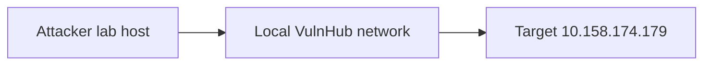
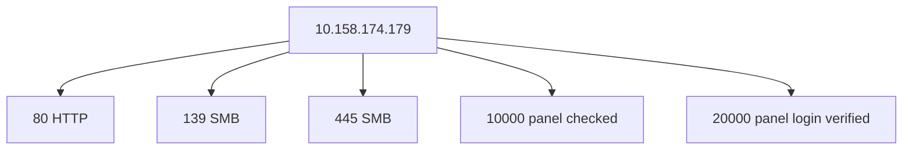
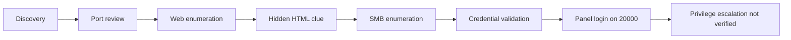
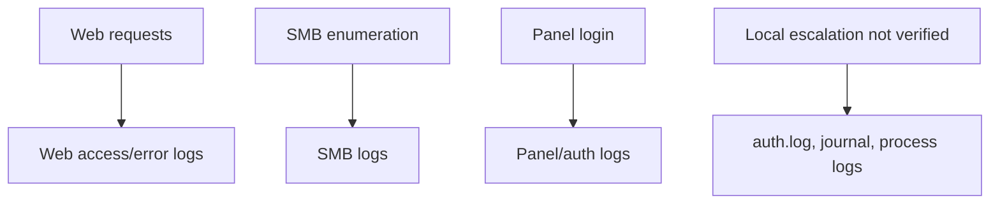

# Diagrams

These Mermaid diagrams are based only on locally verified evidence.

## Network and Discovery

```mermaid
flowchart LR
  A[Attacker lab host] --> B[Local VulnHub network]
  B --> C[Target 10.158.174.179]
```

## Port and Service Map

```mermaid
flowchart TB
  T[10.158.174.179] --> P80[80 HTTP]
  T --> P139[139 SMB]
  T --> P445[445 SMB]
  T --> P10000[10000 panel checked]
  T --> P20000[20000 panel login verified]
```

## Attack Chain

```mermaid
flowchart LR
  Discovery --> PortReview[Port review]
  PortReview --> WebEnum[Web enumeration]
  WebEnum --> HiddenClue[Hidden HTML clue]
  HiddenClue --> SMB[SMB enumeration]
  SMB --> Creds[Credential validation]
  Creds --> Panel[Panel login on 20000]
  Panel --> PE[Privilege escalation not verified]
```

## Defense Mapping

```mermaid
flowchart TB
  Web[Web requests] --> Logs1[Web access/error logs]
  SMB[SMB enumeration] --> Logs2[SMB logs]
  Panel[Panel login] --> Logs3[Panel/auth logs]
  Local[Local escalation not verified] --> Logs4[auth.log, journal, process logs]
```