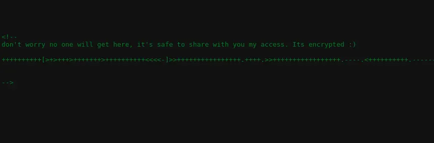

# 03 - Web Enumeration

## Purpose

Determine whether default-looking web content contains hidden clues or management paths.

## Command

HTTP content review was performed with \curl\; directory discovery used the wordlist-based tool listed in the local evidence. Exact commands are preserved in \vidence/sanitized-output/sanitized-notes.txt\.

## Finding

The local drafts state that a hidden HTML comment/clue was found. A protected Apache status endpoint did not provide an entry point.

## Analysis

The hidden clue was treated as a credential candidate and correlated with SMB findings.

## Defense

Web access/error logs can show 404/403 spikes and wordlist behavior. Sensitive comments should not remain in source code.
