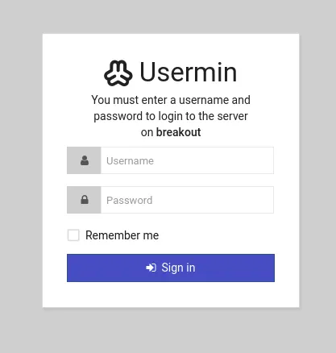

# 05 - Initial Access

## Purpose

Determine which service accepts the verified credential candidate.

## Command

```bash
curl -I http://10.158.174.179:10000
curl -I http://10.158.174.179:20000
```

Browser targets: \https://10.158.174.179:10000\ and \https://10.158.174.179:20000\.

## Finding

According to local README drafts, login failed on port \10000\, while the same lab-only credential worked on \20000\. The credential is not published.



## Analysis

Credential validation is context-dependent; in this lab the verified initial-access point is port \20000\.

## Defense

Panel logs may show failed and successful logins. MFA, IP allowlists and strong password policy are recommended.
