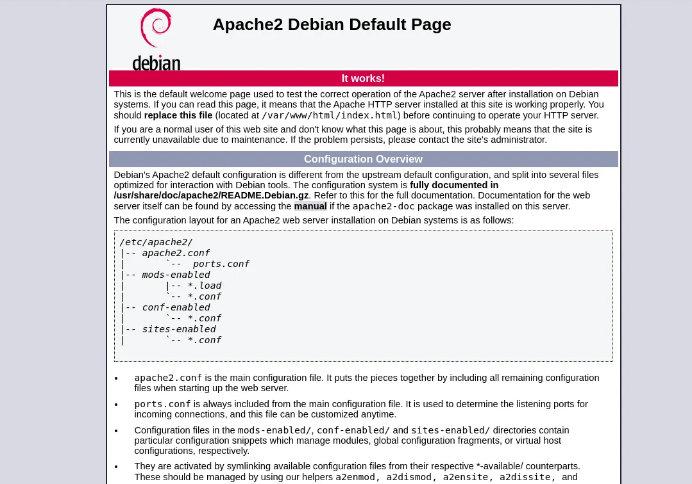

# 01 - Keşif

## Amaç

Yetkili yerel VulnHub ağında hedef sistemi bulmak.

## Komut

```bash
ip a
nmap -sn <LOCAL_SUBNET>
netdiscover -r <LOCAL_SUBNET>
```

## Parametreler

`-sn` port taramadan host keşfi yapar. `-r` netdiscover için ağ aralığıdır.

## Bulgu

Yerel README taslakları hedef IP değerini `10.158.174.179` olarak doğrular. Ham MAC veya ev ağı bilgisi yayımlanmadı.



## Analiz

IP belirlendikten sonra servis yüzeyi incelendi.

## Savunma

Firewall ve IDS logları kısa sürede yapılan host discovery davranışını gösterebilir.